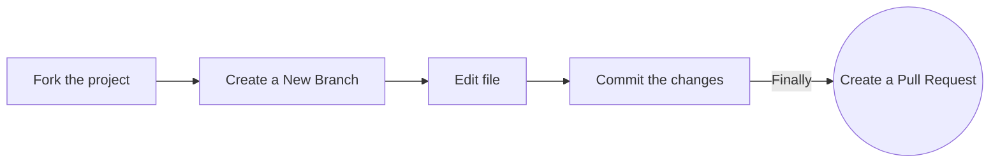

<h1 align="center">Open-source-Practice</h1>
<div align="center">
  
<!-- ALL-CONTRIBUTORS-BADGE:START - Do not remove or modify this section -->

[](#contributors-)
<a href="https://github.com/sanjay-kv/Open-source-Practice/stargazers"></a>
<a href="https://github.com/sanjay-kv/Open-source-Practice/network/members"></a>
<a href="https://github.com/sanjay-kv/Open-source-Practice/pulls"></a>
<a href="https://github.com/sanjay-kv/Open-source-Practice/issues"></a>
<a href="https://github.com/sanjay-kv/Open-source-Practice/graphs/contributors"></a>
<a href="https://github.com/sanjay-kv/Open-source-Practice/blob/master/LICENSE"></a>
[](https://visitcount.itsvg.in)
<!-- ALL-CONTRIBUTORS-BADGE:END -->
This is the all in one place for documentation help regarding the postman challenge.
</div>


I’m [Sanjay](https://github.com/sanjay-kv), your Senior Program Manager, and I'm thrilled to have you all here at gssoc-ext 2024 ✨
 We received tons of applications, and you all stood out as the best. 👏 Congrats on being selected! .
 This repo help you to add your unmerged repo<br>
 - **Remember: Collaboration First, Code 2nd**<br>
[](https://github.com/sanjay-kv/Open-source-Practice)

## Follow these steps carefully to ensure a smooth contribution process!

Repository for you to raise a Pull Request to **practice** open-source! 🎉

### Add your name to the alphabetical list and, optionally, a link to your GitHub account (in alphabetical order below your letter too)

### Option 1. Complete this process in GitHub (in your browser) . or we can do by locally




**1. Fork the project:**

- Click the gray <kbd>Fork</kbd> button at the top right of the previous page. This creates your copy of the project and saves it as a new repository in your GitHub account.
  

**2. Create a New Branch:**

- On your new repository's page, click the gray main button in the upper left to reveal a dropdown menu.
- Enter the name of your new branch in the text box. (Branch names usually refer to what is being changed. Example: nameAdd).
  -Click on Create branch <new branch name>, which will automatically take you to your new branch. You can make edits on the main branch, but this may cause issues down the line. The best practice is to create a new branch for each separate issue you work on. That way your main branch remains in sync with Gssoc's main branch.

**3. Edit:**

- On the top right of the Readme file, click on the pencil icon to edit the file by **adding your name and your GitHub profile link to the section that matches your Initial in [this list](https://github.com/GSSoC24/being-an-GSSoc24/blob/main/docs/readme.md#GSSoC24-Community). Make sure that your name is in alphabetical order.**
- After editing the Readme file, add a commit message and click on the green button saying "Commit Changes". Make sure you have selected the branch you have created.

**4. Raise a Pull Request:**

- Click `Pull Requests` option in your forked repository (which is the third option at the top of this page after the options `Code` and `Issues`).
- Click the green New Pull Request button. This will prep the new pull request for you by auto-filling the base repository: base with 'GssocCommunity: main' AND auto-filling your head repository: compare with your repository: main
- Click on your head repository's `compare` dropdown, and switch branches from your 'main' branch to `<new branch name>`.
- Finally, click the green `Create Pull Request` button. Great job! You did it!

You can ask questions by raising an [issue](https://github.com/GSSoC24/being-an-GSSoc24/issues).

### Option 2. Complete this process on your computer (locally)

**1. Fork the project:**

- Click the gray <kbd>Fork</kbd> button at the top right of the previous page. This creates your copy of the project and saves it as a new repository in your GitHub account.
  

**2. Clone this project on your computer:**

- Go to your profile. You will find forked repo named **_open-source-practice_**. go to the repo by clicking on it.
- Click on the green Code button, then either the HTTPS or SSH option, and, click the icon to copy the URL. Now you have a copy of the project. Thus, you can play around with it locally on your computer.

- Run the following commands into a terminal window (Command Prompt, Powershell, Terminal, Bash, ZSH). Do this to download the forked copy of this repository to your computer.
  

```bash
  git clone https://github.com/GSSoC24/being-an-GSSoc24.git
```

- Switch to the cloned folder. You can paste this command into the same terminal window. 

```bash
  cd being-an-GSSoc24
```

**3. Open in code Editor:**

- Open the `README.md` file
  

**4. Create a new branch:**


- Your username would make a good branch because it's unique.
  

```bash
  git checkout -b <name-of-new-branch>
```

**5. Edit the File:**


- **Add your name to the section that matches your Initial in [this list](https://github.com/EddieHubCommunity/open-source-practice#hacktoberfest-community), make sure that your name is in alphabetical order. Then save your changes.**

- For example
  `- [Full Name](https://github.com/your-username)`

**5. Stage your changes:**

```bash
  git add README.md
```

or

```bash
  git add .
```

**6. Commit the changes:**


```bash
  git commit -m "Add <your-github-username>"
```

- Check the status of your repository.

```bash
  git status
```

- The response should be like this:
  

```bash
On branch <name-of-your-branch>
nothing to commit, working tree clean
```

**7. Pushing your repository to GitHub:**

```bash
  git push origin <name-of-your-branch>
```

or

```bash
  git branch -M main
  git push -u origin main
```


> **Warning**: If you get an error message like the one below, you probably forgot to fork the repository before cloning it. It is best to start over and fork the project repository first.

```bash
ERROR: Permission to https://github.com/GSSoC24/being-an-GSSoc24 denied to <your-github-username>.
fatal: Could not read from remote repository.
Please make sure you have the correct access rights and that the repository exists.
```

**8. Raise a Pull Request:**

- On the GitHub website, navigate to your forked repo - on the top of the files section, you'll notice a new section containing a `Compare & Pull Request` button! ![createpr]

- Click on that button, this will load a new page, comparing the local branch in your forked repository against the main branch in the GSSoC'24 Being an Gssoc repository. Do not make any changes in the selected values of the branches (do so only if needed), and click the green `Create Pull Request` button.
  Note: A pull request allows us to merge your changes with the original project repo.

- Your pull request will be reviewed and then eventually merged.

Hurray! You successfully made your first contribution! 🎉

---

## How can I fix a merge conflict?

A GitHub conflict is when people make changes to the same area or line in a file. This must be fixed before it is merged to prevent collision in the main branch.

- **To read more about this, go to [GitHub Docs - About Merge Conflicts](https://docs.github.com/en/github/collaborating-with-pull-requests/addressing-merge-conflicts/about-merge-conflicts)**

- **To find out about how to fix a Git Conflict, go to [GitHub Docs - Resolve Merge Conflict](https://docs.github.com/en/github/collaborating-with-pull-requests/addressing-merge-conflicts/resolving-a-merge-conflict-on-github)**

## `GSSoC24-Community`

### **Contents**

| [A](#a) | [B](#b) | [C](#c) | [D](#d) | [E](#e) | [F](#f) | [G](#g) | [H](#h) | [I](#i) | [J](#j) | [K](#k) | [L](#l) | [M](#m) | [N](#n) | [O](#o)
| [P](#p) | [Q](#q) | [R](#r) | [S](#s) | [T](#t) | [U](#u) | [V](#v) | [W](#w) | [X](#x) | [Y](#y) | [Z](#z) | [0-9](#0-9) |

- ### **A**

  - [Aditi Arya](https://github.com/aditi29400)
  - [Avilash](https://github.com/avilash01)
  - [Arzoo Singh](https://github.com/arzoosingh147)
   - [Arun Kumar](https://github.com/arun7kumarr)
  -  [Aditi jha](https://github.com/aditijha-123)
  - [Akshay Kumar Dubey](https://github.com/akshaydubey05)
  - [Aditya Routh](https://github.com/adiiiii13)
  - [Aabhirup Paul](https://github.com/paul-abhirup)
  - [Aakruti Kalia](https://github.com/akku-07)
  - [Adithya S Nair](https://github.com/aadhi-i)
  - [Akash Jangra](https://github.com/aakashjangra)
  - [Akshitha Reddy](https://github.com/Akshitha-reddy-13)
  - [Anand Jha](https://github.com/CodewithAnn)
  - [Anshika Saini](https://github.com/Anshikaa-Saini)
  - [Anushree mehta](https://github.com/anushreemehta6)
  - [Arya Sahu](https://github.com/kirbynuggets)
  - [Aryan Karamtoth](https://github.com/spaciouscoder78)
  - [Aaryan Manghnani](https://github.com/AaryanManghnani)
  - [Akash Bharti](https://github.com/Akash19304)
  - [Anshika Saini](https://github.com/Anshikaa-Saini)
  -  [Anushree mehta](https://github.com/anushreemehta6)
  - [Anushree mehta](https://github.com/anushreemehta6)
  - [Aryan Karamtoth](https://github.com/spaciouscoder78)
  - [Arshnoor Kaur](https://github.com/ArshnoorKaur21)
  - [Anirudh Yellamraju](https://github.com/anirudh-why)
  - [Anshika Saini](https://github.com/Anshikaa-Saini)
  - [Anushka Sharma](https://github.com/anu2126)
  -  [Anushree mehta](https://github.com/anushreemehta6)
  - [Anushree mehta](https://github.com/anushreemehta6)
  - [Arya Kesharwani](https://github.com/aryak-1)
  - [Anushka Sharma](https://github.com/Anushka-Sharma-008)
  - [Ayush Trivedi](https://github.com/dev-ayushtrivedi)
  -  [Anushree mehta](https://github.com/anushreemehta6)
  - [Aryan Karamtoth](https://github.com/spaciouscoder78)
  - [Akshay praneeth](https://github.com/Praneeth2312)
  - [Anushree mehta](https://github.com/anushreemehta6)
  - [Aryan Karamtoth](https://github.com/spaciouscoder78)
  - [Afzal Hassan](https://github.com/iemafzalhassan)
  - [Amrutha](https://github.com/AmruthaPariprolu)
  - [Anushree mehta](https://github.com/anushreemehta6)
- [Aabhirup Paul](https://github.com/paul-abhirup)
- [Aakruti Kalia](https://github.com/akku-07)
- [Abhay S N](https://github.com/Abhay182005dat)
- [Abdul](https://github.com/abd0777)
- [Aditi Kapil](https://github.com/Aditi31kapil)
- [Aditi Tapariya](https://github.com/adititapariya)
- [Aditya Anand](https://github.com/shivam2027)
- [Ajay Patidar](https://github.com/Ajay-patidar0)
- [Akash Nema](https://github.com/Akash-nema)
- [Aksh Maheshwari](https://github.com/AkshMaheshwari)
- [Akshat Jain](https://github.com/its-AkshatJain)
- [Amarta Waghani](https://github.com/Amarta113)
- [Amrutha](https://github.com/AmruthaPariprolu)
- [Ankan Mukhopadhyay](https://github.com/Peart-Guy)
- [Anmol Purwar](https://github.com/anmol-2004)
- [Anshika Saini](https://github.com/Anshikaa-Saini)
- [Anuj Chaudhary](https://github.com/Anuj054)
- [Anushka Joshi](https://github.com/ajoshi30)
- [Anushka Kar](https://github.com/Anushka-kar)
- [Anushka Pote](https://github.com/Anushka-Pote)
- [Anushree Mehta](https://github.com/anushreemehta6)
- [Anushree Nair](https://github.com/anushreenair)
- [Archisman Tarafdar](https://github.com/ArchismanT)
- [Aryan Karamtoth](https://github.com/spaciouscoder78)
- [Asha Rani Satpathy](https://github.com/AshaSatpathy08)
- [Atmakuri Manoj Kumar](https://github.com/Manojkumar1007)
- [Avantika Ajit](https://github.com/av0422)
- [Ayushi Baijal](https://github.com/ABaijal9)
- [Aabhirup Paul](https://github.com/paul-abhirup)
- [Aakruti Kalia](https://github.com/akku-07)
- [Abankita Behera](https://github.com/Abankita)
- [Abhishek Agarwal](https://github.com/AbhiBab)
- [Aditi Kapil](https://github.com/Aditi31kapil)
- [Ajay Patidar](https://github.com/Ajay-patidar0)
- [Aksh Maheshwari](https://github.com/AkshMaheshwari)
- [Amarta Waghani](https://github.com/Amarta113)
- [Amrutha](https://github.com/AmruthaPariprolu)
- [Ankan Mukhopadhyay](https://github.com/Peart-Guy)
- [Anshika Saini](https://github.com/Anshikaa-Saini)
- [Anushka Joshi](https://github.com/ajoshi30)
- [Anushka Kar](https://github.com/Anushka-kar)
- [Anushka Pote](https://github.com/Anushka-Pote)
- [Anushree Mehta](https://github.com/anushreemehta6)
- [Archisman Tarafdar](https://github.com/ArchismanT)
- [Aryan Karamtoth](https://github.com/spaciouscoder78)
- [Avantika Ajit](https://github.com/av0422)
 -  [Anushree mehta](https://github.com/anushreemehta6)
 -  [Arun.R](https://github.com/arun0r7)
 -  [Akshaya Reddy Vazrala](https://github.com/akshayavazrala)
 -  [Ashish Kumar Mishra](https://github.com/ashishmishra4444)
  - [Aryan Karamtoth](https://github.com/spaciouscoder78)
  - [Amrutha](https://github.com/Amrutha1d)
  - [Autha Rashmika](https://github.com/rashmikauthaa)
  - [Arunima](https://github.com/arunimasharma33)
  - [Abdul Wahid Khan](https://github.com/Wahid7852)
  -  [Ayushi](https://github.com/Ayushigitgithub)
  -  [Aniket Upadhyay](https://github.com/upadhyayaniket29)
  - [Anish Pujari](https://github.com/anishpujari)
  - [Aman ](https://github.com/AmanSinghh345)
  - [Ankit Mourya](https://github.com/AnkitMourya12)
  - [Amrutha](https://github.com/AmruthaPariprolu)
  - [Abhijeet Kaithwas](https://github.com/jeet-Abhi123)
  - [Ayodya](https://github.com/Ayo-J)
  - [Anurag Panda](https://github.com/AP200408)
  - [Anushka Uniyal](https://github.com/anuni03)
  - [Ayush Singh](https://github.com/royalrajputayush)
  - [Akhtar Khan](https://github.com/itzAk27)
  - [Aman Verma](https://github.com/Aman0413)
 - [Arpita Krishna](https://github.com/Blue-Always)
  - [Anika Lohia](https://github.com/anikalohia)
  - [Akansha Bharadwaj](https://github.com/Akansha452001)
  - [Anitha Mediboyina](https://github.com/Mediboyina)
  -[Akshara Srivastava](https://github.com/akshara12code)
  - [Anushka](https://github.com/anu906)
 - [Ankit Kumar](https://github.com/Spider1109)
  - [Anjali gondesi](https://github.com/gondesi-anjali)
  -  [Anand Saraswat](https://github.com/okayananddd)
  - [Aryan Pachchigar](https://github.com/Dynamic-Aryan)
  - [Aish Mishra](https://github.com/AishMishra001)
  - [Abhay Sen](https://github.com/abhay-sen)
  - [Akshat_Sharma](https://github.com/akshatsharma2407)
  - [Aritra](https://github.com/AritraCh2005)
  - [Ajay Pratap Tomar](https://github.com/ajayprataptomar)
  - [Akshit Padha](https://github.com/vaxxnsh)
  - [Anurag Kumar](https://github.com/AnuragKr24)
  - [Ayush Kumar](https://github.com/codebreaker3008)
  - [Arunava](https://github.com/CapAru)
  - [Amrutha](https://github.com/AmruthaPariprolu)
  - [Anuj Saha](https://github.com/AnujSaha0111)
  - [Anushka Joshi](https://github.com/ajoshi30)
  - [Arpit Gupta](https://github.com/arpit4521)
  - [Anuja Singh](https://github.com/Anuja1227)
  - [Abhishek Agarwal](https://github.com/AbhiBab)
  - [Aditi Kapil](https://github.com/Aditi31kapil)
  - [Aksh Maheshwari](https://github.com/AkshMaheshwari)
  - [Abhishek Gupta](https://github.com/abhishekgupta1906)
  - [Aditya Sharma](https://github.com/Adirealsharma)
  - [Aiswarya Chandrasekharan](https://github.com/Techkunjan)
  - [Arshad Khan](https://github.com/Arshadkh123)
  - [Aishwaryaa](https://github.com/aishwaryaa-coder101)
  - [Aryan Aarav](https://github.com/aryanaarav)
  - [M N Anupsimha].(https://github.com/Anupsimha)
  - [Ashita Tripathi](https://github.com/ASH-KAR)
   - [AimenDev](https://github.com/AimenDev)
  - [Akash Gupta](https://github.com/Akash-Gupta-git)
  - [Abhinendra Singh](https://github.com/singhabhinendra)
   - [Akash Gupta](https://github.com/Akash-Gupta-git)
  - [Abu Bakar](https://github.com/abubakarp789)
  - [Ayoush Kumar](https://github.com/ayoush-kumar)
  - [Arati Ambekar](https://github.com/AratiAmbekar)
  - [Amrit Raj Thakur](https://github.com/Amrit-Raj-17)
 -  [Anushree mehta](https://github.com/anushreemehta6)
 -  [Abhilasha Kamal](https://github.com/abhi-la-sha)
 -  [Aditya Prakash](https://github.com/AdityaPrakash-03)
 -  [Anish Singh Chandel](https://github.com/ChandelAnish)
 -  [Akshay](https://github.com/AkshayKankaria)
  -  [Aniruddha Rawool](https://github.com/rawani123)
 -  [Aishwarya_Kadarla](https://github.com/Aishwaryaa-22)
 -  [Asha Jyothi](https://github.com/Asha0509)
 -  [Ananya Singh](https://github.com/Ananya-Singh1901)
 -  [Aditi Gupta](https://github.com/Aditi-Gupta-dev)
 -  [Aindrela Saha](https://github.com/aindrelasaha)
 -   [Ayushi Pathak](https://github.com/Ayushi22-coder)
  -  [Akshayata Chandramouli](https://github.com/Akshayata101)
 -  [Anushka Chauke](https://github.com/23Anushkac)
  - [Aarya Balwadkar](https://github.com/AaryaBalwadkar)
  - [Agrima Singh](https://github.com/Agrima11)
  - [Aditya Jasoriya](https://github.com/Aditya01229)
  - [Amit Dhiman](https://github.com/amitdhiman5086)
  - [Ayush_Pant](https://github.com/ayushpant007)
  - [Ankita Waghode ](https://github.com/AnkitaWaghode25)
  - [Anshika Gupta](https://github.com/anshika-gupta21)
  - [Akhil Jain](https://github.com/AkhilJain5)
  - [Anushka Jain](https://github.com/AnushkaJainFirst)
  - [Amrita_sinha](https://github.com/asinha828)
  - [Armaan Singh](https://github.com/iarmaanx)
  - [Aryan ](https://github.com/aryan)
  - [Arya Davare](https://github.com/aryadavare19)
  - [Aabhirup Paul](https://github.com/paul-abhirup)
 -  [Apurva Dharam](https://github.com/ApurvaDharam)
 -  [Ambika](https://github.com/Ambika03p)
  - [Arnab Mitra](https://github.com/arnab-mitra)
  -  [Aditya Singh](https://github.com/ascoder1109)
  - [Arjav Sankadasariya](https://github.com/arjav-sankadasariya)
  - [Amaan Sayyed](https://github.com/Viole07)
   - [Avineshwar](https://github.com/GAVINESHWAR)
  - [Avishkar Dhanorkar](https://github.com/avidhanorkar)
  - [Aakruti Kalia](https://github.com/akku-07)
  - [Anjali Vanguri](https://github.com/a-n-u-vanguri)
  - [Ananya Ravikiran Vastare](https://github.com/Ananya-vastare)
  - [Anshika Saini](https://github.com/Anshikaa-Saini)
 -  [AYush](https://github.com/ayush-kumarrai)
 -  [Arya Hawaldar](https://github.com/aryah22)
- [Aabhirup Paul](https://github.com/paul-abhirup)
- [Aakruti Kalia](https://github.com/akku-07)
- [Abankita Behera](https://github.com/Abankita)
- [Abhishek Agarwal](https://github.com/AbhiBab)
- [Aditi Kapil](https://github.com/Aditi31kapil)
- [Aditi Singh](https://github.com/aditibais)
- [Aksh Maheshwari](https://github.com/AkshMaheshwari)
- [Amrutha](https://github.com/AmruthaPariprolu)
- [Anavi Gupta](https://github.com/Anavi972)
- [Ancelia Patrao](https://github.com/ancelia06)
- [Ankan Mukhopadhyay](https://github.com/Peart-Guy)
- [Ansh Bhatt](https://github.com/BhattAnsh)
- [Anshika Saini](https://github.com/Anshikaa-Saini)
- [Anushka Joshi](https://github.com/ajoshi30)
- [Anushka Kar](https://github.com/Anushka-kar)
- [Anushree Mehta](https://github.com/anushreemehta6)
- [Archisman Tarafdar](https://github.com/ArchismanT)
- [Aryan Karamtoth](https://github.com/spaciouscoder78)
- [Abhinendra Singh](https://github.com/singhabhinendra)
- [Anushree mehta](https://github.com/anushreemehta6)
- [Aryan Karamtoth](https://github.com/spaciouscoder78)
- [Argha Sen](https://github.com/ArghaSenn)
- [Amrutha](https://github.com/AmruthaPariprolu)
- [Ankitha R](https://github.com/Ankitha2130)
- Anishadevi
- [Anushka Joshi](https://github.com/ajoshi30)
- [Abhishek Agarwal](https://github.com/AbhiBab)
- [Aditi Kapil](https://github.com/Aditi31kapil)
- [Aksh Maheshwari](https://github.com/AkshMaheshwari)
- [Aryan Arora](https://github.com/AryanArora)
- [Ashutosh Rath](https://github.com/GitGudScrubss)
- [Ayan](https://github.com/Lighting-pixel)
- [Archita Aparajita Rath](https://github.com/archita-a1903)
- [Ananya G Shetty](https://github.com/Ananyashetty7)
- [Archit Srivastava](https://github.com/ArchitSr313)
- [Ananya Gupta](https://github.com/ananyag309)
- [AliGoodarzi-Ai](https://github.com/AliGoodarzi-Ai)
- [Ayan Mondal](https://github.com/trinetra110)
- [Anneshu Nag](https://github.com/NK-Works)
 - [Ankit Gupta](https://github.com/ankitgupta143)
 -  [Astitv Bajpai](https://github.com/astitvabajpai)
 -  [Ashish Santani](https://github.com/ashishraja)
 -  [Akulla Mudunuri](https://github.com/22wh1a12a4)
 -  [Amrutha Gogireddy](https://github.com/amrutha1215)
 -  [Akshitha Chiluka](https://github.com/AKSHITHA-CHILUKA)
- [Amulya Jain](https://github.com/AmulyaJain2004)
- [Anvitha Gadari](https://github.com/Anvitha060)
  | [`Back To Top`](#contents) |


- ### **B**

  - [Baba Sekhar](https://github.com/babasekhar)
  - [Bharat Singh Parihar](https://github.com/bharat3645)


  - [Basireddy Sreehitha](https://github.com/Sreehithabasireddy666)
  - [Badveli Havishya](https://github.com/havishyareddy)
  - [Biswajeet yadav](https://github.com/biswajeetyadavv)
  - [Bhuvana Kadiyam](https://github.com/bhuvanakadiyam)
  - [Benak Deepak](https://github.com/benakdeepak)
  - [Bhuvan Goel](https://github.com/bhuvangoel04)
  - [Bindu Gugulothu](https://github.com/itbindu)
  - [Bindu Sree](https://github.com/Bindusree1515)
  - [Bingumalla Likith](https://github.com/binguliki)
  - [Bharath Vasarla](https://github.com/Bharathhh30)
  - [Bharath](https://github.com/bharath200415/)
  - [Bhargav](https://github.com/BhargavTammana)
  - [Bhumika Gupta](https://github.com/bhumii-ka)
  -  [Bhanushri Chinta](https://github.com/bhanushri12)
- [Bhumika Bhatt](https://github.com/Bhumika1312)
- [Bharat Singh Parihar](https://github.com/bharat3645)
-[Bodisatwa Dutta](https://github.com/BDutta18)
-[Bhanusri Viswanadhapalli](https://github.com/VBhanusr)
-[Boya Surabhi](https://github.com/Surabhiboya)
-[Kudiguntolu Bhavani](https://github.com/bhavanireddy57)


| [`Back To Top`](#contents) |


- ### **C**
  - [Caroline](https://github.com/carolinelall)
  - [Chirag Tomar](https://github.com/chirag-tomar2003)
  - [Chalsi Jain] (https://github.com/Chelsea67jain)
  - [Chalsi Jain](https://github.com/Chelsea67jain)
  - [Chanmeet Kaur](https://github.com/chanmeet01)
  - [Chandan Mahato](https://github.com/Mr-mahato)
  - [Chirag Sharma](https://github.com/chiragHimself)
  - [CH Shivangi](https://github.com/shivi13102)
  - [CoderXYZ14](https://github.com/CoderXYZ14/)
  - [Chaitrali Kore](https://github.com/Chaitralikore)
  - [Chhavi_Rohilla](https://github.com/ChhaviRohilla/)
  - [Chhavi](https://github.com/Chhaviii03)
  - [CPR](https://github.com/CPR)
  - [Chelsea](https://github.com/Chelseasingla1)

| [`Back To Top`](#contents) |


- ### **D**

- [Domakonda Anirudh](https://github.com/anirudh2843)
  - [Darshan T S](https://github.com/Darshants6364)
  - [Deepak lumar shah](https://github.com/deepak9285)
  -[Dharani Neelapuram](https://github.com/Bhoomidhanu12)
  - [Dipesh Mittal](https://github.com/zeeno2616)
  - [Dharshan A](https://github.com/iDharshan)
  - [Dharshanaa](https://github.com/dharshanaagb)
  - [Dimple-Choudhary](https://github.com/Dimple-Choudhary)
  - [Debanik Debnath](https://github.com/Devanik21)
  - [Dharam Patel](https://github.com/Dharam13)
  - [Mohammad Danish](https://github.com/Danish0703)
  - [Divya Gupta](https://github.com/DG8131)
  - [Dhanashree Patil](https://github.com/Dhanashree170)
  - [Dipti Prangya Sahoo](https://github.com/dipti-019)
  - [Dushyant Bhutiyani](https://github.com/dushyant2909)
  - [Dharani](https://github.com/Dharanilakkireddy)
  - [Devaki Joshi](https://github.com/Devaki01)
  - [Dev Patel](https://github.com/DevPatel1023)

  - [Devendra Verma](https://github.com/KDevendra)


  - [Divyadharshini R](https://github.com/d1vyadharsh1n1)
  - [Disha Agrawal](https://github.com/disha3110)
  - [Dishika Vaishkiyar](https://github.com/Dishika18)
  - [Dasari Karthik Reddy](https://github.com/karthikreddydasari)
  - [Dovine K](https://github.com/dovineowuor)
  - [Debadittya Chatterjee](https://github.com/Deba-constructs)
  - [Debasis Sikdar](https://github.com/DebasisX)
  - [Dishi Malviya](https://github.com/dishi890)
  - [Dharini Manimaran](https://github.com/dharumaran)
  - [Daksh Khandelwal](https://github.com/Daksh-khandelwal-1495)
  - [Debangi Ghosh](https://github.com/debangi29)
  - [Dhanush Sai](https://github.com/Decoding-The-Universe)
  - [Dakshata Mishra](https://github.com/daky2024)
  - [Devansh Ojha](https://github.com/Ojha8421)
  - [DorafinaTech](https://github.com/DorafinaTech)
  - [Dhruv Sahu](https://github.com/dhruvsahu611)
  - [Dhruv Pahuja](https://github.com/Dhruv-pahuja)

  | [`Back To Top`](#contents) |

- ### **E**

  - [Ellen Rose James](https://github.com/ellen-rose-james)
  - [EmadCoder](https://github.com/emadcode)
 - [EswarPesala](https://github.com/EswarPesala)
  -  [Eshika Pawar](https://github.com/Eshika-Pawar)
  - [Eunice Adewusi](https://github.com/eadewusic)
  - [Eshita Das](https://github.com/Edasgh)


| [`Back To Top`](#contents) |

- ### **F**

  - [ Fenil Patel ](https://github.com/fenil-ptl)
  - [Faiz Shaikh](https://github.com/Faiz-Shaikh-16)
  - [Fenil Patel](https://github.com/fenil-ptl)
  - [Farhat Momin](https://github.com/farhattt-1203)
  - [Fahmitha Farhana](https://github.com/fah-04)
  - [Tatheer Fathima](https://github.com/T-Fathima)


  | [`Back To Top`](#contents) |


- ### **G**

  - [Gayatri](https://github.com/gayu999Code)
  - [G Avineshwar](https://github.com/GAVINESHWAR)
  - [Gauri](https://github.com/gauribahuguna21)
  - [Gssoc](https://github.com/GSS0C24)
  - [Goldy Patel] (https://github.com/Goldypatel)
  - [Gopika J](https://github.com/biga-codes)
  - [Geetanjali Yadav](https://github.com/In-a-loop)
  - [Gungun](https://github.com/gungun04)
  - [Gungun Jain](https://github.com/gungunjain15)
  - [Ganesh](https://github.com/AA1-34-Ganesh/Automate-google-search-)
  - [Gayathri](https://github.com/GayathriPCh)
  - [Gopikrishnan](https://github.com/gopi-trip)
  - [G Rutvik Sharma](https://github.com/Rutvik-121)
  - [Gaurav](https://github.com/Gaurav-576/)
  - [Greesma](https://github.com/Greesma-225B1)
  - [Greeshma G](https://github.com/greeshma275)
  - [Goldy Patel](https://github.com/Goldypatel)

  | [`Back To Top`](#contents) |


- ### **H**

 - [Harshwardhan Singh Panwar](https://github.com/harshcodesit)
 - [Harsh kanani](https://github.com/IamPossible007)
  - [Harsika](https://github.com/HarsikaKumari)
  - [Harshita](https://github.com/harshitaraina)
  - [Harsh Patel](https://github.com/Harsh260105)
  - [Himanshu](https://github.com/1Himanshu1)
  - [Harshil Tomar](https://github.com/harshiltomar)
  - [HARSHJOSHI](https://github.com/harshjoshi1312)
  - [Himanshu Rai](https://github.com/himanshuraimau)
  -  [Harsh](https://github.com/harshagarwal0401)
  - [Hardik Chandra ](https://github.com/Hardikchandra)
  - [Hamza Ahmad](https://github.com/Hamza20203064)
  - [Hritika Sharan](https://github.com/hritika2409)
  - [Harman](https://github.com/Harman1010)
  -[Hardik Tripathi](https://github.com/HardikTripathi04)
  -  [Himanshu](https://github.com/HE-MAN-22603)
  -[Harshini S](https://github.com/Harshini2015)
 - [Himanshu Saini](https://github.com/psjhimanshu)
 - [Hritika Sharan](https://github.com/hritika2409)
  - [Haritha](https://github.com/harithaguna)
  - [Himanshi](https://github.com/Himanshityagii24)
  - [Harleen kaur](https://github.com/Harleen-786)
    - [Hitanshu Kumar Singh](https://github.com/hitanshu04)
 - [Hema Sree](https://github.com/Hemav009)
  - [Harshitha]((https://github.com/harshitha0004))
  - [Harshitha Grandhi]((https://github.com/Grandhi-Harshitha))
  - [Harsh Kumar Verma](https://github.com/realHKV)
   - [Harshita Pishwe](https://github.com/hpishwe)
- [Hamsika Krishnan Rapolu](https://github.com/Hamsikakrishnan)
- [Hem Raj](https://github.com/Hemraj-7)
- [Himangshu Sharma](https://github.com/HimangshuSharma01)
- [Hritika Sharan](https://github.com/hritika2409)
- [Harshita Joshi](https://github.com/harshita2303)
- [Harsh Kumar](https://github.com/itsharsh2)
- [Harsh Gupta](https://github.com/harshgupta2125)

  | [`Back To Top`](#contents) |


- ### **I**
- [Ishratnoori](https://github.com/Ishratnoori/)
-  [Ishita Saxena](https://github.com/ShadowyBliss)
  - [Itisha](https://github.com/itishacodes)
  - [Irfan](https://github.com/irfanbroo)
  - [Isha](https://github.com/isha2125)
  - [Ishpuneet Singh](https://github.com/ips610)
  - [Ishita](https://github.com/CoderGirl2844)
  - [Itish](https://github.com/emadcode)
  - [Emad](https://github.com/emadcode)
  - [Inam Yadav](https://github.com/INam1995)
  - [Ishika Brar](https://github.com/IshikaBrar21)
  - [Isha Prajapati](https://github.com/ishap11)
  - [Ishitva Joshi](https://github.com/Ishitva744)
  - [Ishaan Karmakar](https://github.com/ISHAAN-KKR)
  - [Ishika sah]( https://github.com/Ishika0-0)
  - [Ishan Kumar](https://github.com/ishankumax)
  - [Ishita Gupta](https://github.com/ishicodz)
  - [Itisha](https://github.com/itishacodes)
 - [Isha](https://github.com/ishagothwad)
  - [Demo](https://github.com/demo)
  - [Isha](https://github.com/avogadroB)
  - [Irtesaam Atfi](https://github.com/irtesaam)

    | [`Back To Top`](#contents) |


- ### **J**

  - [Jay Arora](https://github.com/Jay-ARORA-5572)
  - [Jainam](https://github.com/JainamOswal18)
  - [junain Davids](https://github.com/junluck)
  - [jyoshna dasari](https://github.com/jyoshnadasari)
  - [Jehan](https://github.com/JehanPatel)
  - [Jagjeet](https://github.com/JagjeetChauhan)
  -  [jayanth](https://github.com/jayanth16122005)
  - [Jeet Prajapati](https://github.com/Jeet-0510)
  - [Jasjeev](https://github.com/Jasjeevthecoder)
  - [Karthikeyan](https://github.com/KARTHIKEYANS111)
  -  [Jinnal](https://github.com/jinalraghwani18)
  -  [Jaishree](https://github.com/Jaishree-baskaran)
  -[jayashree behera](https://github.com/Jayashree-04)
  - [Jansi Sabharwal](https://github.com/JansiSabharwal05)
  - [Jyotsna Singh](https://github.com/Akki-58)
- [Jyothsna](https://github.com/JyothsnaThangudu)
  - [Japneet Kaur](https://github.com/Japneet001)
  - [Jayesh Pandey](https://github.com/jayeshpandey01)
 - [Jinam Sancheti](https://github.com/jinamsancheti)
  - [Jisha-TR](https://github.com/Jisha-tr)
  - [Jahnavi](https://github.com/JahnaviDhanaSri)
  - [Jeet Das](https://github.com/JeetDas5)
  - [Tanisha Bansal](https://github.com/TanishaBansal101)
  - [Janeesh](https://github.com/janeeshgithub)
  - [Jeba Rachel Nesica](https://github.com/Jeba-Rachel-Nesica)
  - [Jahnavika gopal](https://github.com/JahnavikaGopalbvrith)
    | [`Back To Top`](#contents) |


- ### **K**
  -[Khushi Dua](https://github.com/Khushi-Dua)
  - [Kashika Gupta](https://github.com/KGupta2601)
  - [Khushi](https://github.com/khushikumari239)
  - [Ketan Sharma](https://github.com/ketan270)
  - [Kapil Kharera](https://github.com/Kapil-Kharera)
  - [Kusumasree](https://github.com/Kusumasree789/Kusumasree789)
  - [Kartikey Pandey](https://github.com/Coder-Kartikey)
  -[Kratika Rajawat](https://github.com/Kratikarajawat70)
- [`KHUSHI YADAV`](https://github.com/kip-07) |
  - [krinal](https://github.com/krinalsuthar)
  - [Krishan](https://github.com/krishan-07)
  - [Khushi Shah](https://github.com/Khushishah224)
  - [Khavyanjali Gopisetty](https://github.com/khavya-798)
  - [Kritika](https://github.com/its-kritika)
  - [Khushi]((https://github.com/kpt2210))
  - [Khushi Pardeshi](https://github.com/khuship23)
  - [Kalyan Chakraborty](https://github.com/Kalyan9064)
  - [K Pavan Kumar](https://github.com/pavankumar4404)
  - [Kartik Raj](https://github.com/KartikRajOfficial)
  - [Kishita Agarwal](https://github.com/Kishita16)
  - [Khushbu Jain](https://github.com/khushbujain41709)
  - [Kulashekar Inkollu](https://github.com/Kulashekar01)
  - [Keertana](https://github.com/kskeertana)
  - [khurshed07](https://github.com/khurshed07)
  - [https://github.com/khurshed07](https://github.com/khurshed07)
  - [https://github.com/khurshed07](https://github.com/khurshed07)
  - [Khushi Kunte](https://github.com/khushikunte)
  -[Kesri N Shukla](https://github.com/kesri9211)
  -[Kashif](https://github.com/Kashif581)
  -  [Kalamatha Eshwari](https://github.com/Kalamatha-Eshwari)
   - [Kshitija Giradkar](https://github.com/KshitijaGiradka)
  - [Khushi Upadhyay](https://github.com/khushi-upadhyay)
  - [Karthik](https://github.com/kartheekmule)
  - [Kushal Gupta](https://github.com/khush200145)
  - [Khushi Khurana](https://github.com/khushikhuranaa2)
  - [Kwinsi Thakkar](https://github.com/22bce355)
  - [Kanishk Jain](https://github.com/Kanishk-03-Jain)
- [KOLLI SRI KRISHNA KARTHIKEYA](https://github.com/KARTHIK174)
  - [Khush Agrawal](https://github.com/Khushagrawal001)
  [Kirtan Soni](https://github.com/sonikirtan110)
  [Kittu Soni](https://github.com/kittu110)
 - [Kaushik Raj](https://github.com/KaushikBarnwal)
-  [Khushmita Kapoor](https://github.com/KhushmitaKapoor)
  -[Ketaki Chakraborty](https://github.com/ketaki-c)
  - [Kartik Gupta](https://github.com/anythingkartik)
  - [Kusum Desai](https://github.com/kusumdesai)
 - [kuldeep sharma](https://github.com/technicalkuldeep)
  - [khushi1315](https://github.com/khushi1315)
  - [Kruthi S B](https://github.com/kruthi-sb)
  - [Kartik Mehta](https://github.com/kartikmehta18)
  - [Kashish Arora](https://github.com/kash-1007)
  - [KAVYA SRI GOPIREDDY](https://github.com/Kavyasrigopireddy)
  - [Khushi gupta](https://github.com/khushigupta86)
  - [Keerthi](https://github.com/n-keerthi-gayathri)
  - [Krish Gupta](https://github.com/KRISHkg31)
  - [Kashvi Chinta](https://github.com/Kashvichinta)
  - 


| [`Back To Top`](#contents) |


- ### **L**

  - [Lalan Kumar](https://github.com/kumar8074)
- [Laksh](https://github.com/Laksh-01/)
  - [Lakshay Aggarwal](https://github.com/lakshay-1809)
  - [Lakshmi Raj vagu](https://github.com/lakshmirajvagu)
  - [Laxmi](https://github.com/Laxelspal)
  - [Lalith Kumar Allu](https://github.com/LalithKumar77)
  - [Likhith Mr](https://github.com/likhith-mr)
  - [Lovely Mahour](https://github.com/lovelymahor)
  - [Likhil N Maiya](https://github.com/lickhill)
  - [Lavany Sai Bollamreddi](https://github.com/lavanyasai-b)
  - [Laxmi Kandivalasa](https://github.com/laxmi47)

  | [`Back To Top`](#contents) |

- ### **M**
  - [Madhura Golatkar](https://github.com/MadGcodes)
  - [Mangalya D Phaye](https://github.com/mdphaye)
  - [Mani Dixit](https://github.com/manidixit51)
  - [Muskan](https://github.com/muskan191103)
  - [MuraliDharan](https://github.com/MuraliDharan7)
   - [Mahendra kumawat](https://github.com/mk016)
  - [Md. Taqui Ansari](https://github.com/taquiansari)
  - [Mahima Gupta](https://github.com/Mahimatestgithub)
  - [Mahek Garala](https://github.com//Mahek-Garala)
  - [Madhuril Bhaskar](https://github.com/Madhuril-Bhaskar)
  - [Madhurima](https://github.com/MadhurimaNayak)
    - [Meet Jariwala](https://github.com/MeetJariwala10)
  - [Mary Njenga](https://github.com/mary446)
  - [Maragatha Meenakshi](https://github.com/MaragathaMeenakshi/)
  - [Mohammad Qamar](https://github.com/Mohammad-Qamar)
  - [Manas Jha](https://github.com/02Manas-jha)
 - [Madhu Lokesh](https://github.com/Madhu-mac)
  - [Menka](https://github.com/codewithishu)
  - [Muskaan](https://github.com/MuskaanMohta)
-[Musfiraa](https://github.com/Mooosiee) |
  - [Moutama Rakshit](https://github.com/moutamarakshit)
  - [Muhammad Baqir](https://github.com/mb-aarfi)
- [Maddu Harshitha](https://github.com/MadduHarshitha30) |
  - [Madhuri](https://github.com/Madhuri36)
- [Mitul Dwivedi](https://github.com/Mitul1927)
  - [Mrigaank Jaswal ](https://github.com/Mrigaank-9)
-[`Manya`](https://github.com/DownOnCoffee) |
 - [Mohit Solanki](https://github.com/mohit2202solanki)
  -  [Mukul Rajput](https://github.com/MUKUL-RAJPUT2004)
  - [Mohit](https://github.com/Mohitgit22)
 - [Mitva Gami](https://github.com/MitvaGami)
  - [Meet Arora](https://github.com/meetarora10)
  - [Mohit Gupta](https://github.com/mtg718)
  -[Muskan Jodhani](https://github.com/muskan18113)
  - [Madhurima Roy](https://github.com/Madhurima-R04)
  - [Mukta Chaudhari](https://github.com/Mukta64Chaudhari)
  - [Mrityunjay Kumar](https://github.com/221fa04732)
  - [MuraliDharan](https://github.com/MuraliDharan7)
  - [Mahima](https://github.com/mahimakathpal)
  - [Maryam Mohamed Yahya](https://github.com/MaryamMohamedYahya)
  - [Mahathi](https://github.com/mahathipuppala)
  - [Manya](https://github.com/nksmanya)
  - Mihir Phalke (https://github.com/mihirphalke1)
  - [Macha Varshitha](https://github.com/Varshitha713)
  - [Mihir Phalke](https://github.com/mihirphalke1)
  - [Muhammad Shoaib Khan](https://github.com/msk21shoaib)
  - [MD REHAN](https://github.com/REHAN-18)
- [Meenal Saini](https://github.com/meenal900)
 - [Manvi Haritwal](https://github.com/manviii27)
- [Md Aiyaz Ansari](https://github.com/mdaiyaz940)
- [Meet Shah](https://github.com/Meetpidev)
  - Md Kaioum Islam (https://github.com/kaiyumdev)
| [`Back To Top`](#contents) |


- ### **N**
  
  - [Nancy Jikadra](https://github.com/Nancyjikadra)
  - [Niranjan Gaikwad](https://github.com/niranjansgitbuh)
  - [Nimit Agarwal](https://github.com/nimitagarwal26)
  - [Nivesh Try](https://github.com/nivesh)
  - [NanoBot](https://github.com/KanishkChhajed)
  - [Neyna Nayak](https://github.com/neyhere07)
  - [Naveen](https://github.com/mishra-naveen-dev)
  - [Nitin Chakrawarti](https://github.com/NitinChakrawarti)
  -  [Nishtha Aggarwal](https://github.com/nishthaaggarwal15)
  -  [Neeru Gangarh](https://github.com/neeru24)
  -  [Neha Kohli](https://github.com/codewidneha)
- [Neha Lakshmi](https://github.com/Nehalakshmi04)
  - [Neha](https://github.com/Nehayp21242929)
  - [Nitisha Patil](https://github.com/Pat25Taylor)
  - [Niharika Behera](https://github.com/Niharika-Behera)
  - [Nisarga G R](https://github.com/nisargaa20)
  -   [Nihal Somarajupalli](https://github.com/Nihal-Somarajupalli)
  - [Nikita](https://github.com/nikkittaa)
  - [Neeraja](https://github.com/NeerajaGurram)
  - [Naincy Kumari](https://github.com/Naincy04)
  - [Nikitha Kandi](https://github.com/nikitha-kandi)
- [Natasha Kushwah](https://github.com/Natasha-kush)
  - [Navjot singh](https://github.com/NAVJOT-786)
  - [Nimai Barman](https://github.com/b-nimai)
 - [Nancy Varyani](https://github.com/nancyvaryani)
  - [Sk Najir](https://github.com/najir83)
  - [`Nittin Balajee`](https://github.com/NittinBalajee1)
 - [Navya zitya](https://github.com/Navyazitya)
  - [Naga](https://github.com/nagalakshmi08)
  - [Nandini Sain](https://github.com/nsain25)
  - [Navjot Singh](https://github.com/navjot369)
 - [Nikhitha Reddy](https://github.com/nik-r-cmd)
 - [Nihar Ranjan Das](https://github.com/nihardas0611)
- [Navuluri Balaji](https://github.com/NavuluriBalaji)
- [Naman Jain](https://github.com/NamanJain795)
- [Niranjan Gaikwad](https://github.com/niranjansgitbuh)
- [Nitheesha](https://github.com/Nitheesha33)
- [Neeraj Sharma](https://github.com/neerajsharma897/)
- [Nidhi Kuntal](https://github.com/nidhi752)
- [Nisarg Shah](https://github.com/nisarg107/)
- [Nishant Dwivedi](https://github.com/nishant4500/)
 - [Nimisha Mavar](https://github.com/Nimisha-Mavar)
  - [Neha Sahu](https://github.com/Neha2580)

| [`Back To Top`](#contents) |

- ### **O**

  - [Ojus](https://github.com/ojuss)
  - [Om Aware](https://github.com/omaware-gg)

| [`Back To Top`](#contents) |

 - ### **P**

    - [Purnima Shrivastava](https://github.com/purn1ma)
    - [Pruthviraj Desale](https://github.com/pruthviraj-desale)
    - [Piyush Bagde](https://github.com/PiyushBagde)
    -  [Piyush Gupta](https://github.com/PiyushG29)
     - [Pavan Gowda T S](https://github.com/pavants777)
     - [Piyush Bagde](https://github.com/PiyushBagde)
     - [Pragya Kumari] (https://github.com/pragyamyra)
     - [Pratham Vishwakarma](https://github.com/Pratham-Vishwakarma)
    - [Prince Gupta](https://github.com/Princegupta101)
     - [Payal Kumari](https://github.com/PayalKumari10)
     - [PRANSHU CHAURASIA](https://github.com/MrPC7)
     - [Prajwal D P](https://github.com/prajwaldp223)
     - [Pearl Ochani](https://github.com/Pearlochani131677)
     - [Piyush Bagde](https://github.com/PiyushBagde)
     - [demo](https://github.com/demo)
    - [Prince Gupta](https://github.com/Princegupta101)
    - [prudhvi](https://github.com/Prudhvi-232)
    - [Pranav Bansal](https://github.com/Prannav-Bansal)
    - [Pratham Vishwakarma](https://github.com/Pratham-Vishwakarma)
    - Pragya Singh(https://github.com/Woookiiee)
    - [Preeti Deora](https://github.com/Preeti-deora)
    - [Pranavi Mehta](https://github.com/pranavimehta13)
    - [Pranavi Srinivasula](https://github.com/Pranavi-04)
    - [Partha Sarathi Panda](https://github.com/PSP2706)
    - [Preethi Kamal](https://github.com/preethikamal)
    - [Pearl Vashistha](https://github.com/pearll12)
    - [Pavan Gowda T S](https://github.com/pavants777)
    - [Prashant Solanki](https://github.com/Prashant-2024)
    - [Pratyaksh Agarwal](https://github.com/Agarwalpratyaksh)
    - [Priyankesh](https://github.com/priyankeshh)
    - [pankaj mourya](https://github.com/PiyushBagde)
    - [Prashant Anand](https://github.com/PrashantAnand03)
    - [Pratik Mane](https://github.com/PratikMane0112)
     - [Pragyan Bhatt](https://github.com/pragyanbhatt1213/)
    - [Purva Athnere](https://github.com/purvathnere)
    - [Prachurya Ray](https://github.com/Prachurya-Ray)
    - [Pranjali](https://github.com/Peanut2123650)
   - [Preeti Kumari](https://github.com/preetikumari5)
    - [Pakhi Joshi](https://github.com/PakhiJoshi)
     - [Prince Barai](https://github.com/1cYinfinity)
     - [Pratibha Singh](https://github.com/singhpratibha98)
    - [Priya Verma](https://github.com/Priyadeara2427)
    - [Priyanshi Negi](https://github.com/priyanshinegi07)
    - [Praharshitha Chunduru](https://github.com/Praharshitha167)
    - [Prathica Shetty M](https://github.com/PrathicaShettyM)
    - [Piyush Kumar Seth](https://github.com/Piyushseth55)
    -  [Phanisai](https://github.com/JVENKATAPHANISAI)
    - [Prakhar Khandelwal](https://github.com/Prakharkhandelwal02)
    - [Prajwal kumar](https://github.com/prajwal9773)
    -  [Pranali Modi](https://github.com/Pranali3103)
    - [Prayag Chavan](https://github.com/PRAYAG0908)
     - [Pallavi Gudupalli](https://github.com/PallaviGudupallavi)
    - [Priyanka Lama](https://github.com/Unalia09)
    - [Prateek Agrawal](https://https://github.com/Prateek0305)
    - [pragnapadamata](https://github.com/pragnapadamata)
    - [Peehu Mishra](https://github.com/Peehu1308)
    - [Pryanshu Gupta](https://github.com/pryang007)
    - [Pranamya G Kulal](https://github.com/spacedust26)
    - [Prashant Anand](https://github.com/PrashantAnand03)
    - [Priyal_Adesara](https://github.com/priyaladesara)
    - [Pranjal](https://github.com/pranjal-kotkar)
    - [Pragyan Thapa](https://github.com/pragyanthapa)
    - [Poorti Jain](https://github.com/poortii)
    - [Prince Choudhury](https://github.com/Prince-Choudhury)
    - [Puneet Tiwari](https://github.com/puneet426)
    - [Pallabi Mondal](https://github.com/pallabisneha)
    - [Pratyasha Mohanty](https://github.com/Nozomi888)
     - [Prabhjot Singh](https://github.com/Prabh-84)
    - [Priyanshi Agrawal](https://github.com/PriyanshiAgr)
    - [Priyanshi Bhargava](https://github.com/Priyanshi0112)
    - [Priyanka Shanyal](https://github.com/Priyankasanyal04)
    - [Parimi Vedavalli](https://github.com/Veda273)
    - [Pushpa Vishwakarma](https://github.com/Pushpa472)
    - [Padmasree Sangani](https://github.com/PadmasreeSangani)
    - [Pallavi Mukalla](https://github.com/Pallavi-Mukalla)
    - [suksham](https://github.com/suksham11)
    - [pinakviramgama](https://github.com/pinakviramgama)
    - [Prathmesh Alkute](https://github.com/ghostmonk017)
   | [`Back To Top`](#contents) |


- ### **Q**

  - [Quatecha Cleveland-Webb](https://www.github.com/Quatecha)
 | [`Back To Top`](#contents) |


- ### **R**
   - [Rohit Motwani](https://github.com/Rohit131313)
[Rajib ](https://github.com/rajib345)
[Riya ](https://github.com/Riya-221)
  - [Rajashree Deb](https://github.com/rajashreeDeb)
  - [Rahul Somani](https://github.com/somani-rahul)
  - [reezybreeze](https://github.com/sanjay-kv)
  - [Rohan Vasudev](https://github.com/rex-pi)
  - [Riya Yadav](https://github.com/R1ya4git)
  - [Rugved Junghare](https://github.com/rugved0102)
  - [Ritika Gaur](https://github.com/kuritika098)
  - [Riddhima](https://github.com/rriddhi-04)
  - [Rohit Ganguly](https://github.com/psychic-coder)
  - [Riya](https://github.com/RiyaRaj28)
- [Riddhi Bhanushali](https://github.com/riffhi)
  - [Riddhi Chandekar](https://github.com/riddhi5474)
  - [RoyalSachan](https://github.com/royalsachan)
  - [Rimi Singh](https://github.com/singhrimiumesh)
  -  [Rahul Yadav](https://github.com/rahul-2004-json)
  - [Rama](https://github.com/ramajaiswal08)
- [Rakshit](https://github.com/Rakshit-gen)
- [Rana Jay](https://github.com/RanaJay3101)
- [Ranjan Kumar Pandit](https://github.com/Ranj8521Kumar)
- [Rees8 (Rhea)](https://github.com/rees8)
- [Ritik Sinha](https://github.com/RitikSinha04)
- [Ritik Singh](https://github.com/ritiksingh-01)
- [Riya](https://github.com/Riya-221)
- [Riya Arora](https://github.com/riyaarora954)
- [Rudransh Pratap Singh](https://github.com/CoderFleet)
 - [Ravindra Kumar](https://github.com/Ravindrak0812)
  - [Rohit](https://github.com/MrCodYrohit)
  - [Rajneesh Kumar Arya]([#content](https://github.com/Rajneeshkarya)
- [Rishmita](https://github.com/rishmiiee26)
- [RadhaRashmitha Jujjavarapu](https://github.com/rashmitha155)
  - [Rizwan Ahmad](github.com/Rizwanahmad07)
  - [Rishita Chourey](https://github.com/RishitaChourey)
   - [Rahul](https://github.com/Sadhvika55)
  - [Rishita Rani](https://github.com/TechSenseiX)
  - [Rahuf khan](https://github.com/Rahufkhan)
  - [Ritika Sahu](https://github.com/Ritika-sahu)
  - [Riddhima Sharma](https://github.com/Riddhima-sh)
  - [Richa Dasila](https://github.com/richa-dasila)
  - [Riddhi](https://github.com/RiddhiMenroy)
  - [Rahul kumar](https://github.com/mrrahulkrr)
- [Rahul Sahu](https://github.com/rahuls49)
- [Roushan Verma](https://github.com/roushanverma23)
- [Rakshit](https://github.com/Rakshit-gen)
- [Rhea](https://github.com/rees8)
- [Rudransh Pratap Singh](https://github.com/CoderFleet)
- [Riya](https://github.com/Riya-221)
- [Rana Jay](https://github.com/RanaJay3101)
- [Ritik Singh](https://github.com/ritiksingh-01)
- [Ritik Sinha](https://github.com/RitikSinha04)
- [Riya Arora](https://github.com/riyaarora954)
- [Rohit Mukherjee](https://github.com/rickyrick23)
- [Riya Sudrik](https://github.com/jigglypufflazybaby)
- [Rao Shreyank Reddy](https://github.com/shreyank-reddy)
- [Rydham](https://github.com/rydhamguptaa)
  - [Rida Hasan](https://github.com/ridayeah)
  - [Ritik Tiwari](https://github.com/RitikTiwari7379)
- [Rohan Matre](https://github.com/RohanMatre)
- [Renee Bethapudy](https://github.com/ren12a2)
[Riya ](https://github.com/Riya-221)
- [Rounak Raman](https://github.com/RounakRaman)
- [Rajnil Saha](https://github.com/rajnil9)


  | [`Back To Top`](#contents) |
  
 - ### **S**

    -  [Subhranil Nandy](https://github.com/Subhranil2004)
 - [Sam](https://github.com/samgupta221)
 - [Samar Singla](https://github.com/SAMluci666) 
  - Sameeksha Gupta link: https://github.com/sameekshaagupta
    -  [Sai](https://github.com/SaiKumar297)
    -  [Shubhi](https://github.com/ShubhiGupta20)
    -  [Satyam-Pratibhan](https://github.com/SATYAM-PRATIBHAN)
     -  [Sailza](https://github.com/Sailza)
     -  [Sai](https://github.com/SaiKumar297)
    - [Shuvojit Samanta](https://github.com/shuvojitss)
    -  [Sumit](https://github.com/mesumitkumarsk)
    -  [Salman Ahmed](https://github.com/salmanahmed-chd)
    -  [Sanchit Chauhan](https://github.com/sanchitc05)
    -  [Sanjay](https://github.com/sanjay-kv)
    -  [Somya](https://github.com/somya)
    -  [Sanchit](https://github.com/Sanchit029)
    -  [Shruti Mishra](https://github.com/shruti-mishraa)
    -  [Sagar](https://github.com/sagargupta028)
    -  [Soham](https://github.com/soham)
     -  [Shivani](https://github.com/Shivanipalya26)
     -  [Sonali Sengar](https://github.com/Sonalisngr)
    -  [Saleena Das](https://github.com/saleena-18)
     -  [Swetha](https://github.com/swetha5157)
    -  [Sanskruti Kulkarni](https://github.com/SanskrutiKulkarni)
    -  [Sunay_Pendela](https://github.com/SunayP)
    -  [Suraj](https://github.com/suraj1803)
    -  [Samya Mehta](https://github.com/samyamehta16)
    -  [Sharmi](https://github.com/sharmi4590)
    -  [Sangati](https://github.com/sangati12)
    -  [Sowmya K S](https://github.com/Sowmya-K-S)
    -  [Suhasini](https://github.com/suhasiniChoudhari)
    -  [Shaunak](https://github.com/Chalseyji)
    -  [Siddhi Singh](https://github.com/Siddhi561)
    -  [Srujan V](https://github.com/SrujanV010)
    -  [Sunil Gopal](https://github.com/SunilGopalCV)
    -  [Shravan Jain](https://github.com/Shravan121005)
    -  [Shridhar](https://github.com/Shridhar2104)
    -  [Swayam](https://github.com/swayamag2004)
    -  [Shubhadip Bhowmik](https://github.com/subhadipbhowmik)
    -  [Sanu Kumar](https://github.com/sk66641)
    -  [Siddharth Dubey](https://github.com/siddub306)
    -  [Sachin](https://github.com/Sharmaji513)
    -  [sohan](https://github.com/sohan-gupthak)
    -  [Shivam Gaur](https://github.com/shivamgaur99)
    -  [Sudipa](https://github.com/sudipamandal)
    -  [Sanikommu Devi](https://github.com/Sanikommus)
    -  [Sarthak](https://github.com/sarthaknitnaware)
    -  [Shreesanyog Rath](https://github.com/Shreesanyog)
    -  [Sahil](https://github.com/kalalsahil)
    -  [Sasidhara Kashyap Chaturvedula](https://github.com/sasidhara-kashyap0903)
    -  [Swapnil Srivastava](https://github.com/Swapnilden/)
    -  [Shereen](https://github.com/shereen-24)
     -  [Srivardhan Kondu](https://github.com/srivardhan-kondu)
    -  [Saketh](https://github.com/Saketh1714)
    -  [Shubhra Narang](https://github.com/Shubhra-Narang)
    -   [Shamyuktha](https://github.com/Shamyuktha06)
    -  [Sourin Mukherjee](https://github.com/i-am-faith)
    -  [Srinidhi Kulkarni](https://github.com/srinidhifd)
    -  [Sarvani](https://github.com/itssarvani394))
    -  [Samhitha V K](https://github.com/hithasam24)
    -  [Sakshi Aggarwal](https://github.com/sakshiglaze)
    -  [Siphokazi](www.github.com/sipsdaoracle)
    -  [Shaik Tabassum Shabana](https://github.com/Tabassum-13)
    -  [Samiksha](https://github.com/samikshapandagle)
    -  [supriya](https://github.com/supriyajathar)
    -  [Sudipta Das](https://github.com/sdass1918)
    -  [Samyak Maitre](https://github.com/samyakmaitre)
    -  [Shreyan Dhar](https://github.com/woodwolfswee)
    -  [Sravani Kallempudi](https://github.com/Sravani-Kallempudi)
    -  [Sai Sruthisri](https://github.com/SaiSruthisri)
    -  [Sonali](https://github.com/Sammandy)
    -  [Shobit](https://github.com/shobit000)
    -  [Sanskar](https://github.com/SanskarShrivastava)
    - [Sayantan Saha](https://github.com/Sayantan1024)
    - [Sneha Giri](https://github.com/Snehagiri554)
    -  [Saketh Surya](https://github.com/saketh-05)
    - [Sitambhra](https://github.com/Sitambhra02)

    - [Shivathmika ](https://github.com/shivathmikavemula)
    - [Shamayita Datta](https://github.com/shamayitadatta)
    -  [Sanjay](https://github.com/sanjay-kv)
    -  [Seersha](https://github.com/Seersha9802)
    -  [Sivani](https://github.com/ImmidiSivani)
    - [Sithkar](https://github.com/Saurabh-Sithkar)
    -  [Srushti Patel](https://github.com/srush953)
    -  [Srinivas](https://github.com/Srinivas1358)
    -  [Seersha](https://github.com/Seersha9802)
    -  [Sivani](https://github.com/ImmidiSivani)
    -  [Shreya Paul](https://github.com/shreya-paul-17)
    -  [Samarth](https://github.com/striton08)
    -  [Srushti MKandagal](https://github.com/srushtikandagal)
    -  [Sanidhya](https://github.com/ssanidhya0407)
    - [Sanaya Mahajan](https://github.com/sanayamahajan-23)
    -  [Shreya Paul](https://github.com/shreya-paul-17)
    -  [Sathwika](https://github.com/sathwika)
    -  [Sumit Gorai](https://github.com/SumitGorai01)
    -  [Shivanjali](https://github.com/shivanjalikarande)
    -  [Shreyas Nair](https://github.com/Shreyas20004)
    -  [Shreya Paul](https://github.com/shreya-paul-17)
    -  [Sri Lekha](https://github.com/srilekha279)
    -  [Sahil Soni](https://github.com/sahil0414)
    -  [Sanskruti Yeole](https://github.com/yeolesanskruti)
    -  [Sonakshi](https://github.com/sonakshisonkusare)
    - [Suhita](https://github.com/KarSuhita)
    - [Sudhanshu Kumar Roy](https://github.com/sudhanshu576)
    - [Soodula123](https://github.com/Soodula123)
    - [Sanjay](https://github.com/sanjay-kv)
    - [Seersha](https://github.com/Seersha9802)
    - [Sivani](https://github.com/ImmidiSivani)
    - [Shreya Paul](https://github.com/shreya-paul-17)
    - [Sadath Hussain](https://github.com/sadath2001)
    - [Sadath Hussain.2](https://github.com/sadath2001)
- [Sadath Hussain](https://github.com/sadath2001)
- [Sagar](https://github.com/Unknownmaster0)
- [Sai Kuladeep](https://github.com/saikuladeepgithub)
- [Sai Madhuri](https://github.com/Madhuri36)
- [Sai Manikanta Patro](https://github.com/SaiMani30)
- [Saisri Vishwanath](https://github.com/saisri0102)
- [Saif ali](https://github.com/supersaif08)
- [Sahil M Patil](https://github.com/SAHILMPATIL)
- [Sahil Singh](https://github.com/sahilsingh2002)
- [Sahithi](https://github.com/sahithialeti)
- [Samarasimha Reddy Peyala](https://github.com/samarasimhapeyala)
- [Samridha Das](https://github.com/Samridha0305)
- [Samriddha Halder](https://github.com/Samriddha49)
- [Sandeep Garai](https://github.com/sandeep-garai)
- [Sandhyarani](https://github.com/Sandhyarani23)
- [Sandip Dey](https://github.com/Helios-snd)
- [Sanika Deokule](https://github.com/sanikadeokule)
- [Sanjana](https://github.com/sanjanaapandey)
- [Sanjana Davuluri](https://github.com/it221291)
- [Sanjay](https://github.com/sanjay-kv)
- [Sanjay KV](https://github.com/sanjay-kv)
- [Sanya](https://github.com/s4sanyaa)
- [Sarthak Chandvaria](https://github.com/sarthaxtic)
- [Sasidharan V](https://github.com/Thewhitewolfsasi)
- [Satya](https://github.com/satyaveni299)
- [SatyaD012](https://github.com/SatyaD012)
- [Satyavani](https://github.com/satyaveni299)
- [Sauravi Sar](https://github.com/SarthVader2004)
- [Sayan Maity](https://github.com/Sayanmaity2003)
- [Seersha](https://github.com/Seersha9802)
- [Shadab](https://github.com/shadabalam78698)
- [Shagun](https://github.com/gitshott)
- [Shaik Hafiza](https://github.com/ShaikHafiza)
- [Shamayita Datta](https://github.com/shamayitadatta)
- [Sharitha](https://github.com/SHARITHA2002)
- [Shariq](https://github.com/Shariq2003)
- [Shashmitha](https://github.com/shashmitha46)
- [Shdevi](https://github.com/Sridevi0321)
- [Shivam Chauhan](https://github.com/Shivamm138)
- [Shivarathri Jayanth Rahul](https://github.com/761jayanth8)
- [Shivathmika](https://github.com/shivathmikavemula)
- [Shivanshu Kumar Srivastava](https://github.com/githubshivanshukumarsrivastava)
- [Shreya Bagchi](https://github.com/BagchiShreya)
- [Shreya Paul](https://github.com/shreya-paul-17)
- [Shreeyansh](https://github.com/SHREEYANSH764)
- [Shreya Rangappagari](https://github.com/shreya03-shr)
- [Shriya Dindi](https://github.com/shriyadindi)
- [Shruti Sachan](https://github.com/shrutisachan08)
- [Shuvojit Samanta](https://github.com/shuvojitss)
- [Siwani](https://github.com/Siwanikaushik)
- [Sk Asraful](https://github.com/iamasraful)
- [Sk Sofiquee Fiaz](https://github.com/RandomSummer)
- [Sibam](https://github.com/Sibam-Paul)
- [Sibangi Boxipatro](https://github.com/Sibangi-2911)
- [Siddharth](https://github.com/gunner26735)
- [Siddhima De](https://github.com/siddhima22)
- [Simanta Sarma](https://github.com/SimantaSarma)
- [Simran Kukreja](https://github.com/Simran-0024/demo-try)
- [Sinchana](https://github.com/sinchana91)
- [Sneha Giri](https://github.com/Snehagiri554)
- [Sneha S](https://github.com/MavSneha)
- [Sneha Sahu](https://github.com/snehasahu7)
- [Sobhit Singhal](https://github.com/sobhitsinghal)
- [Soha Farhana](https://github.com/SohaFarhana)
- [Somya Aggarwal](https://github.com/SomyaAggarwal1209)
- [Somya Saxena](https://github.com/somyasaxena01)
- [Sree](https://github.com/Sree)
- [Srilalitha](https://github.com/gantasrilaitha)
- [Sridevi](https://github.com/Sridevi0321)
- [Srujana Patra](https://github.com/SrujanaPatra)
- [Subashree S](https://github.com/Subashree-selvaraj)
- [Sudhish](https://github.com/Sudhish23)
- [Sudiksha18](https://github.com/Sudiksha18)
- [Suhaina Fathima M](https://github.com/SuhainaFathimaM)
- [Suhitha](https://github.com/suhitha02)
- [Sumantrini Sarkar](https://github.com/Sumantrini48)
- [Sumit Kumar](https://github.com/07sumit1002)
- [Sumalatha Salapu](https://github.com/SumaLatha2023)
- [Swata Swayam Dash](https://github.com/swataswayam-14)
- [Swayam Takkamore](https://github.com/SwayamTakkamore)
- [Swapnita Singh](https://github.com/Swapnita06)
- [Swastik Giri](https://github.com/SwastikGiri)
- [Syed Shadab](https://github.com/shadabalam78698)
- [Sanika Bhalerao](https://github.com/SanikaBhalerao1345)
- [Shiven Yadav S](https://github.com/shivenyadavs)
- [Siddhi Soni](https://github.com/Siddhisony)
- [Samriddhi Tiwary](https://github.com/samriddhitiwary)
- [Sanskriti Mishra](https://github.com/sanskritim2302)
-  [Shaanif ahmed](https://github.com/shaanif600)
| [`Back To Top`](#contents) |

- ### **T**

- [Tanishka](https://github.com/tanishkasaxena)
- [Tanmay Deopurkar](https://github.com/tanmays62343)
- [Teejay](https://github.com/teejay)
- [Tejas Gupta](https://github.com/multiverseweb)
- [T.Manas](https://github.com/tmanas06)
  - [Tulika](https://github.com/tulikaa25)
  - [Tina](https://github.com/tinaa25)
  - [Tuhin Subhra](https://github.com/tuhinsubhra)
  - [Tanishq Singh](https://github.com/singhtanishq)
  -  [Tanya Nagpal](https://github.com/Tanya-Nagpal)
  - [Tanish Rai](https://github.com/Tanish2510)
  - [T Rahul Prabhu](https://github.com/T-Rahul-prabhu-38)
  - [T.Manas](https://github.com/tmanas06)
  - [Teejay](https://github.com/teejay)
      - [Tejaswini|GeekyGirl](https://github.com/tejaswini4996)
  - [Tarun](https://github.com/Tarungupta18)
  - [Tejaswi](https://github.com/TejaswiKandunuri)
  - [Tejasri](https://github.com/Tejasri-Pendota)
  - [Tejaswini](https://github.com/Tejaswini-628)
  - [Tanishq Gupta](https://github.com/hxtanishq)
  - [Teja Kumar](https://www.github.com/TejaKumar123)
  - [Tuba Khan](https://github.com/tubakhxn)
 - [Tanaya](https://github.com/Tanaya-1-2-3)
  - [Tanisha](https://github.com/tanisha290)
  - [Tanmay Deopurkar](https://github.com/tanmays62343)
  - [Tushar Vij](https://github.com/Tushar-Vij)
  - [Tisha Yadav](https://github.com/TishaYadav14)
  - [Tanisha](https://github.com/Tanishasi)
  - [Tirth Panchal](https://github.com/Panchal-Tirth)
  - [Tushar Bansal](https://github.com/Tusharb331)
  - [TR](https://github.com/TR)
  - [TR.1](https://github.com/TR)
 - [theritwik](https://github.com/theritwik)
 - [Tanushree Bagde](https://github.com/Tanushree084)
 - [Tanish Raj Singh](https://github.com/tanishraj7)

  | [`Back To Top`](#contents) |


- ### **U**

  - [Udbhav Mittal](https://github.com/udbhav26)


- [uma](https://github.com/Uma-129)
  - [Utkarsh Gupta](https://github.com/Shadowsweep)


| [`Back To Top`](#contents) |

- ### **V**

  - [Vriddhi](https://github.com/thisismevri) |
  - [Vansh Mehta](https://github.com/vanshm2703)
  -  [Vibhu](https://github.com/Vibhugoell)
  - [Vanshika Agarwal](https://github.com/VanshikaAg12)
  - [Vaishnavi Gupta](https://github.com/Vaishnavigupta1312)
- [Vijay Sekar](https://github.com/Code-with-vijaysekar)
  - [Vasavipriya](https://github.com/dadigavasavipriya)
  - [Venkata Sri Sai Ch](https://twitter.com/Venkat670)
  - [Venu](https://github.com/flute-v)
  - [Vandana](https://github.com/Vandana)
  - [Vishal Jhariya](https://github.com/Vis1hal)
  - [Vishnu Babu A R](https://github.com/Vishnu-Babu)
  - [Vaishnavi](https://github.com/vaishnavikarra)
  - [Vaibhav M N](https://github.com/Vaibhav2154)
  - [Varsha](https://github.com/varsha-kotegar)
  - [Varunshiyam](https://github.com/varunshiyam)
  - [Vishal Lodhi](https://github.com/lodhivishalcoder28)
  - [Vaishnavi Mahindrakar](https://github.com/Vaishnavi4008)
  - [Vaidehi Pate](https://github.com/vsmp47)
- [Vishal Rajput](https://github.com/1235vishal)
  - [Vijay Samant](https://github.com/VijaySamant4368)
  - [Vaishnavi](https://github.com/illusion1412)
  - [vivek](https://github.com/Vivek11550)
  - [Varun Sethi](https://github.com/Varun-Sethi-Dev)
  -  [Vatsal](https://github.com/Vatsal-D07)
  - [Vaishali](https://github.com/Vaishali-ajmera)
- [vaidehi](https://github.com/vaidehi134) |
- [Viraj]([https://github.com/Virucodes) |
  - [Varun Allagh](https://github.com/varunallagh21022002)
  - [Varshini.E](https://github.com/Varshini0703)
  - [Vanisha Gupta](https://github.com/V-anisha)
- [VarshaYadav](https://github.com/rainybug11)
- [Virendra](https://github.com/virenK0211)) |
  - [Varshitha YS](https://github.com/Varshithays)
  - [vishal-sharma-369](https://github.com/vishal-sharma-369)
  - [Vanshika](https://github.com/VanshikaSabharwal)
  - [Vanshika Pal](https://github.com/Vika0408)
  - [Vaishali](https://github.com/Vaishalic288)
  - [Vishal Maurya](https://github.com/vishalmaurya850)
  - [Vishvajeet](https://github.com/Vishvajeetr)
  - [Vishal Manve](https://github.com/vishalmanve)
  - [Varsha Dewangan](https://github.com/Varsha-1605)
  - [Vaibhav Bura](https://github.com/vaibhavbura)
  - [Vibhu Patel](https://github.com/Vibhu315)
  - [Varsha Pandian](https://github.com/varshapandiann)
  - [Varsha Dewangan](https://github.com/Varsha-1605)
  - [Vivek Rawat](https://github.com/vivekrawat21)
  - [Venkata Naga Gopal Varma Sagi](https://github.com/varma-101)-
  - [Vedant Kale](https://github.com/VedantKale29)
  - [Vedant Patel](https://github.com/vedant3337)
  - [Vaishali Sharma](https://github.com/vaishali-sharma-20)
  - [vivek kumar ray](https://github.com/royvivi29)
  - [Vishal Nadarge](https://github.com/vishalnadarge)
  - [Vidhan](https://github.com/VidhanThakur09)
    
| [`Back To Top`](#contents) |


- ### **W**

- [Wenli.Shi]( https://github.com/strawberrydontlie)
 | [`Back To Top`](#contents) |

- ### **X**

-
| [`Back To Top`](#contents) |

- ### **Y**

  - [Yash Joshi](https://github.com/Yash1943)
- [Yash Verma](https://github.com/Rajput-xv)
-  [Yeddula Epafra](https://github.com/YEpafra20)
-  [Yuvraj Singh](https://github.com/yuvraj-singh009)
  - [Yathish G P](https://github.com/YathishGP003)
  -  [Yeshaswi](https://github.com/yp9435)
  -  [YASHIKA KEDIA](https://github.com/yashikakedia)
-[YASH_SRIVASTAVA](https://github.com/yash21sriv)
  - [Yash Tyagi](https://github.com/yash-tyagi-2003)
  - [Yashika Garg](https://github.com/yashi-025)
  - [Yatin Sabikhi](https://github.com/Yatin-Sabikhi)
  -  [Yashika Sharma](https://github.com/yashika1900)
  - [Yashika Goyal](https://github.com/yashika-45/)
  -  [Yashvi Goyal](https://github.com/yg2505)
  | [`Back To Top`](#contents) |


- ### **Z**

  - [Zubaida Sehnaz](https://github.com/Zubaida0113)
  - [ZEUGANG WILSON PRODIGE](https://github.com/wilsonprodige)
  - [Zoey](https://github.com/zoey-11)
  | [`Back To Top`](#contents) |

## Our Pledge

We take participation in our community as a harassment-free experience for everyone and we pledge to act in ways to contribute to an open, welcoming, diverse and inclusive community.
